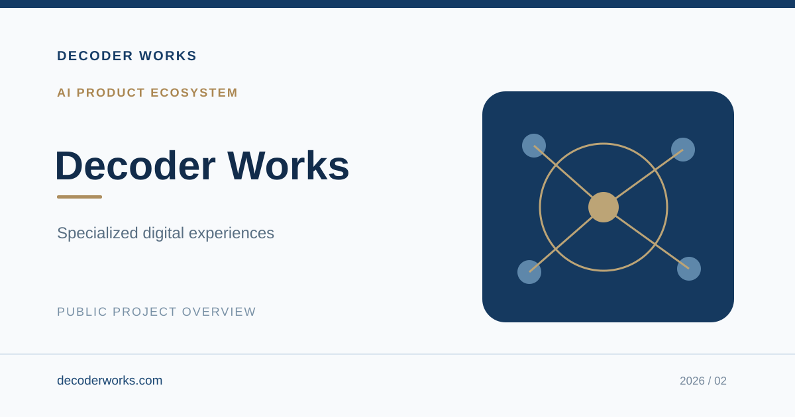

# Decoder Works

**AI Product Ecosystem · Product Design & Development**

An evolving family of purpose-built digital experiences centered on clarity, usability, and practical applications of AI.

## Key Use Cases

- Make complex information easier to understand and use.
- Support focused creative, educational, and productivity experiences.
- Offer accessible digital tools through a consistent product identity.

## My Contribution

Product vision, interface and user experience design, feature direction, prototype development, and iterative product testing.

## Project Access

**Portfolio:** Public overview only  
**Working products:** Private or separately deployed  
**Source code:** Not published in this repository

This is a curated, non-executable portfolio. It does not reveal application logic, technical architecture, internal product roadmaps, proprietary workflows, credentials, or sensitive information. The cover is illustrative, not a production screenshot.

## More Information

**Website:** [decoderworks.com](https://decoderworks.com)  
**Email:** [info@decoderworks.com](mailto:info@decoderworks.com)

---

*© 2026 Decoder Works. Public portfolio summary only. No software license is granted.*
